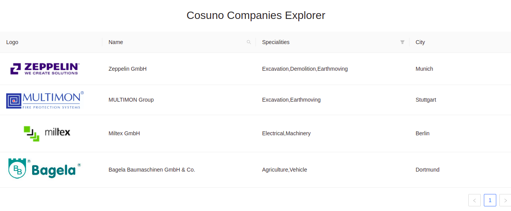
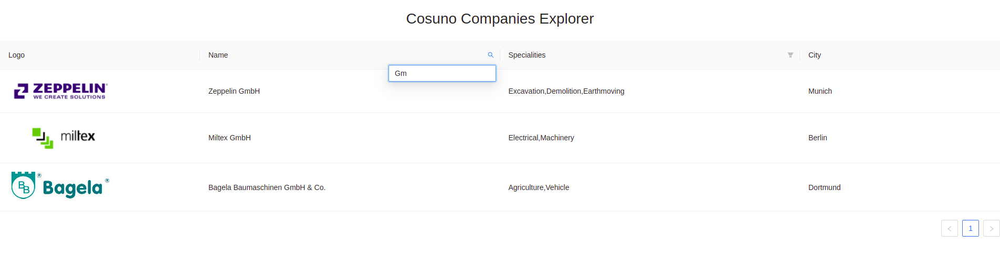
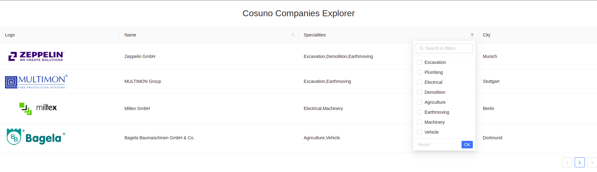

# CosunoApp

Simple react application that shows information of each company as in its location, logo and specializations.

You can search companies based on their names or filter out based on their specialities.

Along with the react app there is a node api which provides the list of company information in this Json file: apps/server/src/utils/companies.json

# NX

This project is a monorepo generated using [Nx](https://nx.dev).

🔎 **Smart, Fast and Extensible Build System**

## Adding capabilities to your workspace

Nx supports many plugins which add capabilities for developing different types of applications and different tools.

These capabilities include generating applications, libraries, etc as well as the devtools to test, and build projects as well.
  
# Usage
You can start off by installing dependancies of the apps using:

`npm install`

You can then execute both app and server using: 

`npm start`

To execute server only: 

`npm run start:server`

To execute client only: 

`npm run start:client`

## Things to implement in future:
- This application would be better in future once added all unit tests, e2e tests and integration tests.

# Screenshots

  Homepage
  
  Search Companies
  
  Filter by specialities
  

